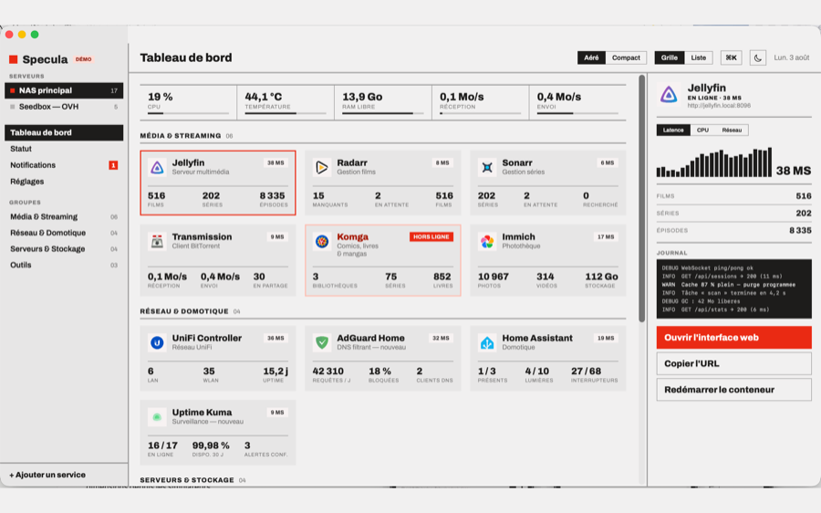
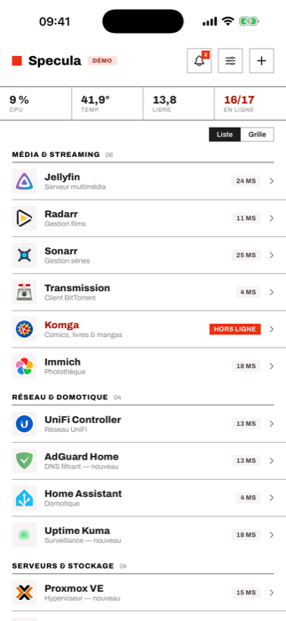
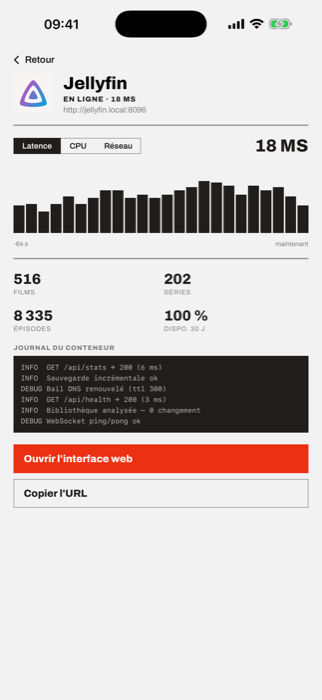
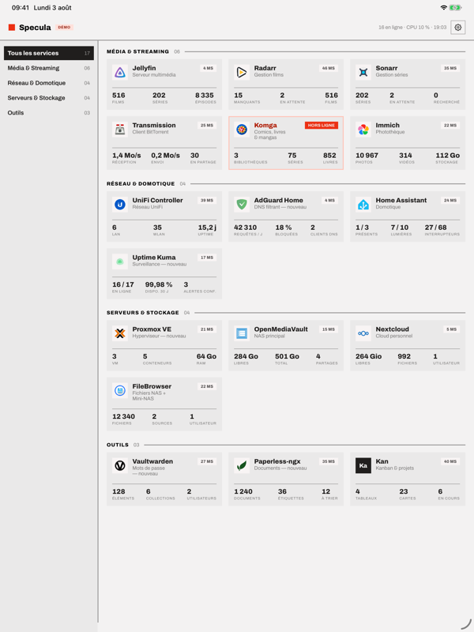
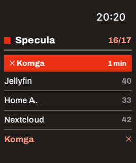

  

<h1 align="center">Specula</h1>

  
  
  
  
  
  

  <b>Specula</b> est un tableau de bord homelab natif pour iPhone, iPad, Mac et Apple Watch —
  le principe de <a href="https://gethomepage.dev">gethomepage.dev</a>, porté en SwiftUI. 
  Il lit les <b>vraies métriques</b> de tes services auto-hébergés, repère les pannes,
  et alimente widgets et complications avec l'état réel.

<i>Specula</i> : la tour de guet, en latin.

## 🛠 TestFlight

La bêta est ouverte. Un seul lien pour l'iPhone, l'iPad et le Mac ; l'app Watch
s'installe avec celle de l'iPhone.

Nécessite **iOS/iPadOS 26, macOS 26, watchOS 26**. Aucune version antérieure n'est
prise en charge.

## 📸 Captures

  

  
  
  
  

<em>Mode démo — toutes les surfaces fonctionnent sans homelab.</em>

## ✨ Fonctionnalités

- **Plus de soixante intégrations** — Jellyfin, \*arr, AdGuard, Proxmox, Immich,
  Nextcloud, Home Assistant, UniFi, Portainer, Vaultwarden, Paperless et d'autres,
  reconnues automatiquement et lues via leur propre API.
- **Détection de panne** — trois tentatives échouées passent un service hors ligne,
  avec notification et Live Activity. Le mur de statut garde trente jours d'historique
  et calcule la disponibilité réelle.
- **Sur tous tes écrans** — widgets sur l'écran d'accueil, complications au poignet,
  accès depuis la barre de menus du Mac.
- **Mode démo** — données simulées, panne scénarisée, aucun homelab requis. C'est là
  que l'app s'ouvre au premier lancement.

## 🚀 Prise en main

Trois façons d'ajouter tes services, proposées au premier lancement et disponibles à
tout moment dans les réglages :

- **Scanner le réseau** en Bonjour — Specula trouve ce qui s'annonce et devine chaque
  type.
- **Importer un `services.yaml`** au format gethomepage.dev — groupes, URL et widgets
  sont repris tels quels.
- **Saisir une adresse** à la main.

Une seule URL par service : ce qui rend un homelab joignable de l'extérieur — VPN,
reverse proxy, tunnel — se règle sous l'app, pas dedans.

## 🔒 Vie privée

Aucun compte, aucune télémétrie, aucun serveur intermédiaire. L'app parle à tes
machines et à rien d'autre, et les clés API vivent dans le trousseau — jamais dans une
sauvegarde, jamais sur iCloud.

Une exception : les logos des services viennent du CDN public
[dashboard-icons](https://github.com/homarr-labs/dashboard-icons) via jsDelivr, qui
voit donc quels logos sont demandés — jamais tes adresses ni tes données. Un
interrupteur dans les réglages le coupe, l'app retombe alors sur des monogrammes.

## ⚙️ Développement

`project.yml` est la source de vérité — le projet Xcode est généré par
[XcodeGen](https://github.com/yonaskolb/XcodeGen). Voir
[CONTRIBUTING.md](CONTRIBUTING.md) pour l'installation.

Les commits doivent être des [Conventional Commits](https://www.conventionalcommits.org)
valides : le dépôt est branché sur release-please, et un en-tête mal formé est
purement ignoré.

Le design suit un système « Modernist » — flat, architectural, radius 0, filets
structurels, un seul accent rouge (`#ec3013`), typographie Archivo.

## 📄 Licence

[GPL-3.0](LICENSE) © nysia. Toute redistribution, modifiée ou non, reste sous la même
licence et publie ses sources.

L'app est par ailleurs publiée sur l'App Store, dont les conditions sont incompatibles
avec la GPLv3 : les contributions demandent donc une autorisation de distribution
supplémentaire, décrite dans
[CONTRIBUTING.md](CONTRIBUTING.md#licence-et-distribution).

**Nom et icône** — la licence porte sur le code. Le nom « Specula » et l'icône de
l'application n'en font pas partie et restent la propriété de leur auteur. Compiler,
étudier, modifier et redistribuer le code reste entièrement libre ; un fork distribué
publiquement doit simplement porter un autre nom et une autre icône, comme le veut
l'usage du logiciel libre.

La police Archivo (Omnibus-Type) est distribuée sous
[SIL Open Font License 1.1](Resources/Fonts/OFL.txt), indépendamment du code.
